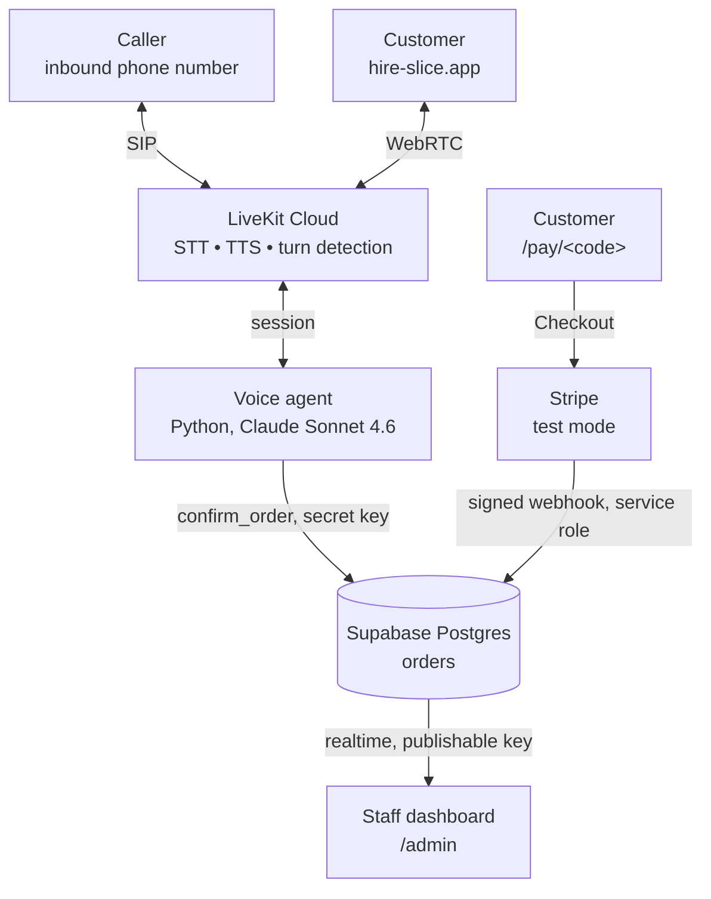

# Hire Slice

A voice agent that takes pizza orders — takeout or delivery — by phone or on the web, with a
staff dashboard that shows orders as they're placed and a Stripe page that takes payment for
catering. Built on [LiveKit Agents](https://docs.livekit.io/agents/), Supabase, and Stripe.

One agent serves both front doors. A phone caller reaches it over SIP, a web visitor over WebRTC,
and both run identical code — the only difference is which transport dispatched the session, which
is what the dashboard uses to label an order `phone` or `web`.



## Layout

```
hire-slice/
├── agent/                 Python voice agent (uv + LiveKit Agents + Anthropic)
│   ├── src/               agent, ordering tools, menu, order state, Supabase writer
│   ├── tests/             99 tests: unit + behavior evals
│   └── Dockerfile         deployed to LiveKit Cloud
├── frontend/              Next.js — ordering page, /admin dashboard, /pay + Stripe webhook
├── supabase/
│   └── migrations/        schema, RLS policies
└── package.json           script runner; you shouldn't need to cd
```

## Quickstart

```bash
pnpm setup     # installs frontend + agent, seeds .env.local files
pnpm dev       # runs agent and frontend together
```

Then fill in `agent/.env.local` and `frontend/.env.local` (see each `.env.example`), and apply
every file in `supabase/migrations/` in order in the Supabase SQL editor.

| Command | What it does |
|---|---|
| `pnpm dev` | Agent + frontend together |
| `pnpm dev:frontend` | Frontend only — use this when an agent is already deployed |
| `pnpm agent:console` | Talk to the agent in the terminal, no browser |
| `pnpm test` | Agent test suite |
| `pnpm lint` | Ruff + ESLint across both |
| `pnpm agent:deploy` | Build and deploy the agent to LiveKit Cloud |

`pnpm dev` starts a local agent that registers under the same name as the deployed one, and the
two then compete for inbound calls. Against a live deployment, run `pnpm dev:frontend`.

Stripe runs in test mode. `stripe listen --forward-to localhost:3000/api/stripe/webhook` prints
the `whsec_` that `STRIPE_WEBHOOK_SECRET` needs; without it running, nothing can mark a deposit
paid locally.

## Where the order goes

The cart being built mid-call lives in `session.userdata` — working memory for one conversation.
Fifteen turns of "actually make that two" produce **one** row, written once at `confirm_order`,
because that's when the order is actually committed. Writing at confirm rather than at hangup also
means the row appears on the dashboard while the caller is still on the line.

The agent writes with the Supabase secret key and bypasses RLS. The dashboard reads with the
publishable key under a read-only policy, and never inserts. In a real deployment this write would
target the shop's existing POS instead — Toast, Square, Slice — and the interesting problem is the
same either way: check-then-commit is never atomic against a system you don't own.

## Deploying

The agent runs as a container on LiveKit Cloud (`pnpm agent:deploy`, which is
`lk agent create ./agent`). `SUPABASE_URL` and `SUPABASE_SERVICE_ROLE_KEY` must be set as agent
secrets; LiveKit injects the `LIVEKIT_*` values automatically.

The frontend is an ordinary Next.js app and deploys anywhere.

## Reading further

- [`agent/README.md`](agent/README.md) — the voice pipeline, the ordering tools, and three
  non-obvious things that are load-bearing (the model pin, explicit VAD, and the committed lockfile)
- [`AGENTS.md`](AGENTS.md) — conventions for working in this repo, including how to check LiveKit
  docs rather than writing APIs from memory
